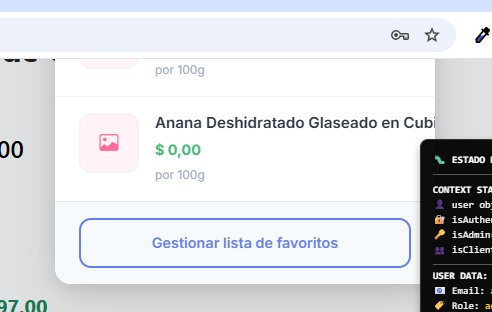

# 🌿 DeliciasNaturales

---

## **ANOTACIONES**

### **Mejoras de UX/UI**
- **Paginación mejorada**: Se podría hacer que cuando se apriete un botón en el paginado en los productos no se regrese al inicio de la página. En ML se queda como está sin moverse de la posición de la barra de desplazamiento para que sea más cómodo y no desoriente al usuario.
- **Diseño visual**: Sacar el recuadro de banners gris.
- **Badges**: Alinear los badge's hacia la izquierda.
- **Animaciones**: Arreglar la animación y diseño del carrousel

### **Sistema de Filtros y Búsqueda**
**Filtros de Categorías:** [lateral y el buscador]
- de la Z-A (descendente)
- Search, buscador en categorías
- Cambiar la URI

**Optimizaciones de búsqueda:**
- En el Search de la página, sacar que busque también por descripción. Por marca y nombre del producto es suficiente.
- Las actualizaciones sobre un producto son muy lentas. Averiguar porqué.

### **Sistema de Precios y Descuentos**
- **Precio promocional**: Precio Tachado con precio de venta cuando sea con descuento.
- **Visualización**: En el dropdown de favoritos solo se muestra bien los precios del CASO 2 pero no del CASO 1.

### **Estructura de los ítems de configuración OWO**
- **Estructura**: Modularizar los CSS.
- **Nomenclatura**: Cambiar el nombre del simple_app.py por app.py.

### **Funcionalidades Pendientes**
- **Gestión de productos**: Al eliminar un producto que salga Deshacer acción.
- **Documentación legal**: Hacer los Términos y Condiciones.
- **Importación**: Terminar el importador de productos de Excel.
- **Proceso de compra**: Falta todo el proceso de Finalizar compra.
- **Administración**: Edición de productos masivos.

### **Autenticación y Sesiones**
- **Redirecciones**: Una vez logeado, si se va a la URL de logueo, solo que redirija a /inicio. Lo mismo correo /registrar y los otros formularios. 
- **Bug de sesión**: No debería abrirse el formulario de iniciar sesión si el Usuario ya tiene una sesión activa en el navegador.
- **Expiración de token**: Cuando el token se venza, se debería obligar al Usuario a Iniciar Sesión.

### **Carrito y Lista de Favoritos**
- **Navegación**: **SUGERENCIA** - En el Carrito que los nombres de los productos sean un hipervínculo así, en el momento de clickearlo se redirija al DetalleProducto en particular.
- **Imágenes**: No se muestra la foto del producto en la Lista de Favoritos.
- **Actualización**: Al hacer F5 en la Lista de Favoritos no se actualiza el precio de forma dinámica. Parece que solo se actualiza si se cierra sesión y se inicia de vuelta. (Nota: si se reinicia con F5 sí se actualiza el precio en la Lista de Favoritos).

### **Bugs**
- **Interfaz de productos**: Si el título del nombre del producto es muy grande aparecerá así sin posibilidad de que se vea el botón de borrado:

- **Gestión de usuarios**: Eliminar usuario no anda.
- **Permisos de administrador**: No se debería dejar por UI que el admin se cambie los permisos visualmente.

---

## **CARACTERÍSTICAS OPCIONALES (A CONSIDERAR)**
- **Inventario**: Colocar un campo stock en los productos.

---
